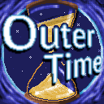

# Outer Time
## By Final Singularity

  
*This work is licensed under a [Creative Commons Attribution-ShareAlike 4.0 International License](https://creativecommons.org/licenses/by-sa/4.0/).*

Outer Time is a custom map for Minecraft 1.19+, which has a unique random dungeon, filled with plenty of loot, and mobs.  
You play as a group of rival treasure scavengers, pilfering alternate timelines for resources, and bringing them back to sell in their dystopian cyberpunk timeliine.

This map was made by Final Singularity:
- Moxvallix -- Coding, Art
- Wulfian -- Building, Art
- Jaxboom -- Building
